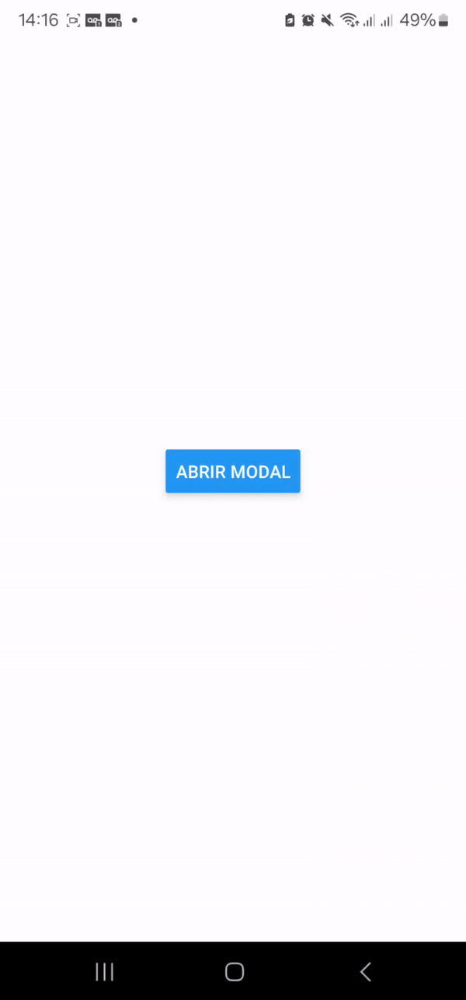

<h1 align="center">
    Global Modal
</h1>

  <a href="#rocket-tecnologias">Tecnologias</a>&nbsp;&nbsp;&nbsp;|&nbsp;&nbsp;&nbsp;
  <a href="#memo-licença">Licença</a>

  

## :rocket: Tecnologias

Esse projeto foi desenvolvido no com as seguintes tecnologias:

- [React Native](https://reactnative.dev/)
- [Expo](https://docs.expo.dev/)
- [React Native Reanimated](https://docs.swmansion.com/react-native-reanimated/)

## :memo: Licença

Este projeto está sob a licença MIT. Veja a [LICENÇA](https://github.com/LucasRobert123/rn-global-modal/blob/main/LICENCE.TXT) para mais informações.

---

Feito com ❤️ por Lucas Robert 👋🏽 Entre em contato!

